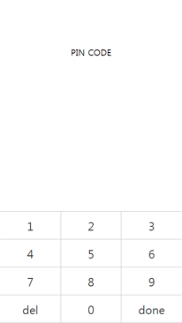
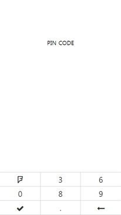
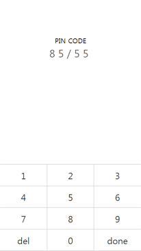
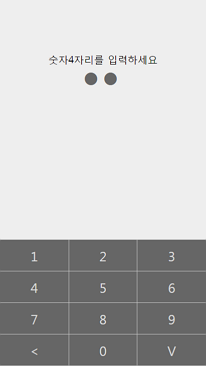
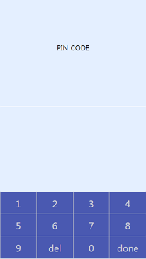
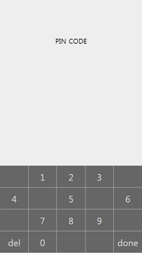
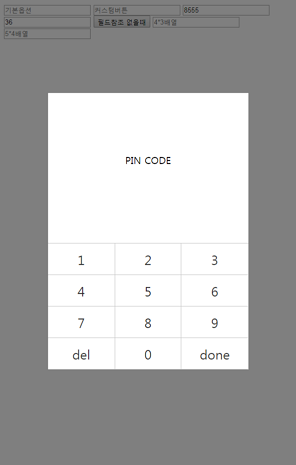

# pinpad

Pinpad for Desktop and Smartphone Environments









## require
pinpad.css
pinpad.js
JQuery

## basic usage

```html
<input type="text" id="pin1" />
<script>
new pinpad({
	ref : {
		el : '#pin1'
	}
});
</script>
```

## button customize
```js
new pinpad({
	ref : {
		el : '#pin2'
	},
	height : 45,
	keypads : [ 4, 3, 6, 0, 8, 9, 'done', '.', 'del'],
	letterReplace : {
		'del' : '<i class="fa fa-long-arrow-left" data-toggle="tooltip" title="fa fa-long-arrow-left"></i>',
		'done' : '<i class="fa fa-check" data-toggle="tooltip" title="fa fa-check"></i>'
	},
});
```

## text formatting

```js
new pinpad({
	ref : {
		el : '#pin3',
		useFormat : true
	},
	maxLength : 4,
	format : '**/**'
});
```

## skin change

```js
new pinpad({
	ref : {
		el : '#pin4'
	},
	skin : 'gray',
	passcode : true,
	desc : '숫자4자리를 입력하세요'
});
```

## no ref element
```js
var pin5 = new pinpad({
	oncomplete : function(value) {
		alert(value);
	},
	passcode : true
});
$('#pin5').on('click', function() {
	pin5.show();
});
```
## 4x3, 5x4 
```js
new pinpad({
	ref : {
		el : '#pin6'
	},
	skin : 'blue',
	mode : 'x4'
});

new pinpad({
	ref : {
		el : '#pin7'
	},
	skin : 'gray',
	mode : 'x5',
	setRandomSpaceCount : 8
});
```

## option list

* `ref.el` (optional) : Dom element
* `ref.useFormat` (optional, defaults to False) : When input is completed, the formatted values are passed.
*	`height` (optional, defaults to 60): Height of each button
* `keypads` (optional, defaults to [1, 2, 3, 4, 5, 6, 7, 8, 9, 'del', 0, 'done']) : Character array definition
*	`letterReplace` (optional) : It can change the text of a button to another character.
* `format` (optional) : Formatting text on the screen
*	`immediate` (optional, defaults to False) : Close immediately when the maximum length is entered. This option need to  `maxLength`
* `maxLength` (optional) : Maximum Inputable Length. There is no need to set the format value.
* `skin` (optional, defaults to '') : basic, gray, blue
*	`passcode` (optional, defaults to False) : Hide text
* `desc` (optional, defaults to 'PIN CODE') : Input Value Description
* `oncomplete` (optional) : A function that is performed when the input value is completed.
*	`mode` (optional, defaults to 'x3') : Number of horizontal buttons. x3/x4/x5
*	`setRandomSpaceCount` (optional, defaults to 0) : Add the space button to any position on the keypad.

